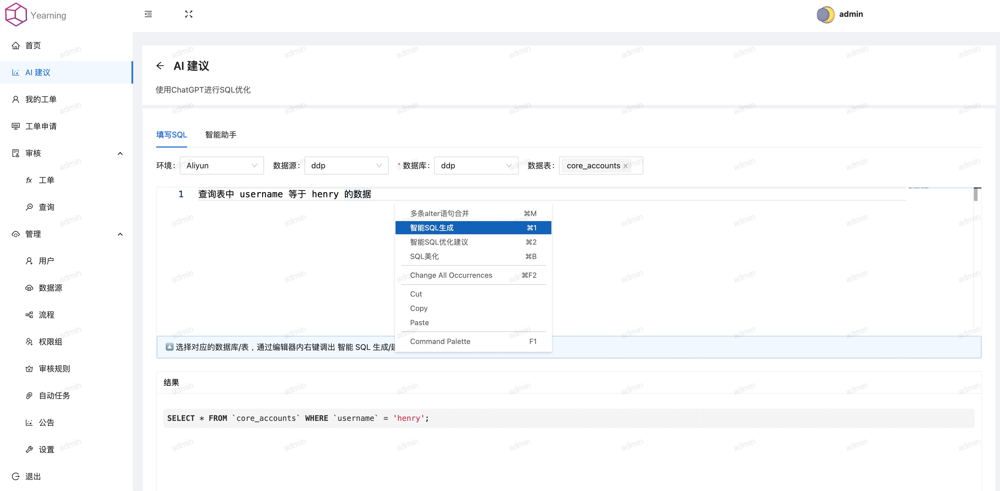
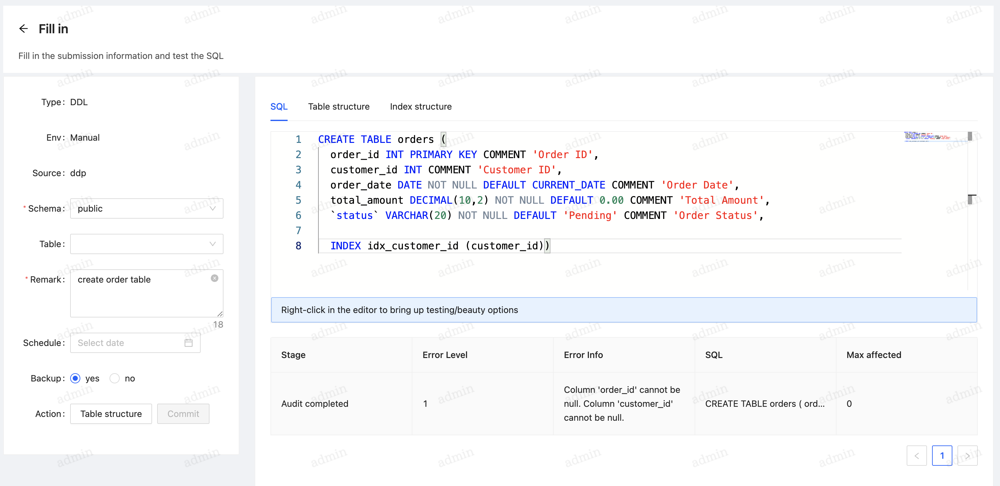
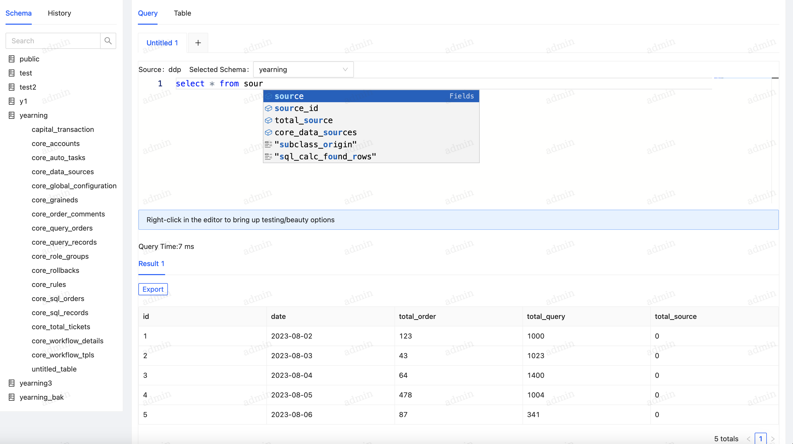
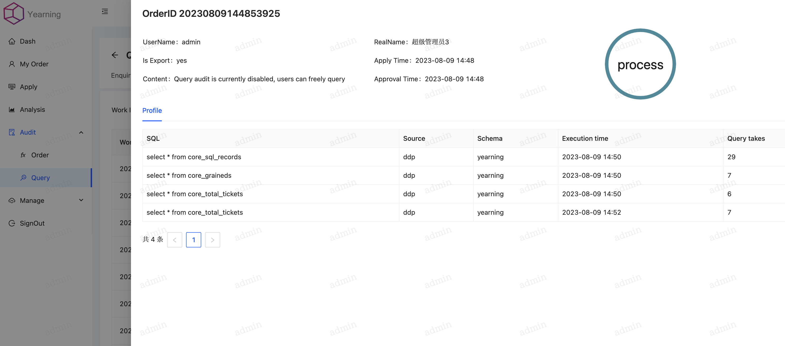

# Yearning

一个强大且本地部署的平台，专为数据库管理员（DBA）和开发人员设计，提供无缝的SQL检测和查询审计。专注于隐私和效率，为MYSQL审计提供直观且安全的环境。

## ✨ 功能

- **AI 助手**：我们的AI助手提供实时SQL优化建议，提升SQL性能。同时支持文本到SQL的转换，允许用户输入自然语言并接收优化后的SQL语句。
  
- **SQL 审计**：创建具有审批工作流和自动语法检查的SQL审计工单。验证SQL语句的正确性、安全性和合规性。为DDL/DML操作自动生成回滚语句，并提供全面的历史记录以便追溯。

- **查询审计**：审计用户查询，限制数据源和数据库，并匿名化敏感字段。查询记录被保存以供将来参考。

- **检查规则**：我们的自动语法检查器支持多种检查规则，适用于大多数自动检查场景。

- **隐私保护**：Yearning是一个本地部署的开源解决方案，确保您的数据库和SQL语句的安全。它包括加密机制以保护敏感数据，即使在未经授权的访问情况下也能确保数据安全。

- **RBAC（基于角色的访问控制）**：创建和管理具有特定权限的角色，根据用户角色限制对查询工单、审计功能和其他敏感操作的访问。

> [!TIP]
>
> 有关更详细的信息，请访问我们的 [Yearning 文档](https://next.yearning.io)。

## ⚙️ 安装

下载 [最新发布](https://github.com/cookieY/Yearning/releases/latest) 并解压。在继续之前，请确保已配置 `./config.toml`。

### 手动安装

```bash
## 初始化数据库
./Yearning install

## 启动 Yearning
./Yearning run

## 帮助
./Yearning --help
```

### 🚀 使用 Docker 部署
```bash
## 初始化数据库
docker run --rm -it -p8000:8000 -e SECRET_KEY=$SECRET_KEY -e MYSQL_USER=$MYSQL_USER -e MYSQL_ADDR=$MYSQL_ADDR -e MYSQL_PASSWORD=$MYSQL_PASSWORD -e MYSQL_DB=$Yearning_DB -e Y_LANG=zh_CN yeelabs/yearning "/opt/Yearning install"

## 启动 Yearning
docker run -d -it -p8000:8000 -e SECRET_KEY=$SECRET_KEY -e MYSQL_USER=$MYSQL_USER -e MYSQL_ADDR=$MYSQL_ADDR -e MYSQL_PASSWORD=$MYSQL_PASSWORD -e MYSQL_DB=$Yearning_DB -e Y_LANG=zh_CN yeelabs/yearning
```
## 🤖 AI 助手

我们的AI助手利用大型语言模型提供SQL优化建议和文本到SQL的转换。无论是使用默认还是自定义提示词，AI助手都能通过优化语句和将自然语言输入转换为SQL查询来提升SQL性能。



## 🔖 自动SQL检查器

自动SQL检查器根据预定义的规则和语法评估SQL语句。确保语句符合特定的编码标准、最佳实践和安全要求，提供了强大的验证层。



## 💡 SQL 语法高亮和自动补全

通过SQL语法高亮和自动补全功能提高查询编写效率。这些功能帮助用户在视觉上区分SQL查询的不同部分，如关键字、表名、列名和运算符，使阅读和理解查询结构变得更容易。



## ⏺️ 订单/查询记录

我们的平台支持对用户订单和查询语句的审计。该功能允许您跟踪和记录所有查询操作，包括数据源、数据库和敏感字段的处理，确保查询操作符合规定并提供查询历史的可追溯性。



通过关注这些关键功能，Yearning提升了用户体验，优化了SQL性能，并确保数据库操作的强大合规性和可追溯性。